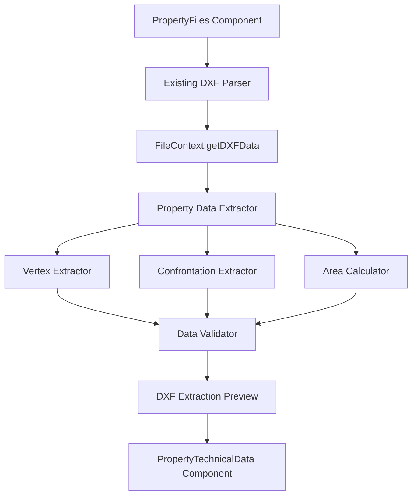

# Design da Extração Automática de Dados Técnicos do DXF

## Overview

O sistema de extração automática de dados DXF será integrado ao cadastro de propriedades existente, processando arquivos DXF carregados na aba "Arquivos" e populando automaticamente os dados técnicos na aba correspondente.

## Architecture

### Integração com Sistema Existente

O sistema aproveitará a infraestrutura DXF existente (`src/utils/dxfParser.ts`, `ViewerDXF.tsx`) e o contexto de arquivos (`FileContext.tsx`):



### Fluxo de Dados Integrado

1. **Upload**: Usuário carrega arquivo DXF na aba "Arquivos" (já funciona)
2. **Parsing**: Sistema usa `parseDXF()` existente para extrair entidades
3. **Contexto**: Dados DXF são armazenados no `FileContext` (já implementado)
4. **Detecção**: PropertyTechnicalData detecta dados DXF disponíveis e oferece extração
5. **Processamento**: Property Data Extractor processa entidades DXF existentes
6. **Prévia**: Preview Component exibe dados extraídos para validação
7. **Confirmação**: Dados são transferidos para formulário de dados técnicos

## Components and Interfaces

### 1. Property Data Extractor (`src/services/propertyDataExtractor.ts`)

Novo serviço que utiliza os dados já parseados pelo sistema existente:

```typescript
interface PropertyDataExtractor {
  extractFromDXFData(dxfData: DXFData): PropertyExtractionResult;
  extractVertices(entities: DXFEntity[]): PropertyVertex[];
  extractConfrontations(entities: DXFEntity[]): Confrontation[];
  calculateGeometry(vertices: PropertyVertex[]): GeometryData;
}

interface PropertyExtractionResult {
  vertices: PropertyVertex[];
  confrontations: Confrontation[];
  area: number;
  perimeter: number;
  coordinateSystem: string;
  metadata: ExtractionMetadata;
  errors: string[];
  warnings: string[];
}

// Reutilizar tipos existentes do dxfParser.ts
import type { DXFData, DXFEntity } from '@/utils/dxfParser';
```

### 2. Geometry Analyzer (`src/services/geometryAnalyzer.ts`)

```typescript
interface GeometryAnalyzer {
  identifyVertices(entities: DXFEntity[]): PropertyVertex[];
  calculateDistances(vertices: PropertyVertex[]): number[];
  determineDirections(startVertex: PropertyVertex, endVertex: PropertyVertex): string;
  validateGeometry(vertices: PropertyVertex[]): ValidationResult;
}

interface PropertyVertex {
  id: string;
  name: string; // P1, P2, etc.
  x: number;
  y: number;
  z?: number;
  description?: string;
  source: 'extracted' | 'manual';
}
```

### 3. Text Extractor (`src/services/textExtractor.ts`)

```typescript
interface TextExtractor {
  extractStreetNames(textElements: TextElement[]): string[];
  identifyVertexLabels(textElements: TextElement[]): VertexLabel[];
  extractAreaInformation(textElements: TextElement[]): AreaInfo[];
  associateTextWithGeometry(textElements: TextElement[], vertices: PropertyVertex[]): TextAssociation[];
}

interface TextElement {
  text: string;
  x: number;
  y: number;
  layer: string;
  height: number;
  rotation: number;
}
```

### 4. DXF Extraction Preview Component (`src/components/property/DXFExtractionPreview.tsx`)

```typescript
interface DXFExtractionPreviewProps {
  extractionResult: DXFParseResult;
  onConfirm: (data: TechnicalData) => void;
  onCancel: () => void;
  onEdit: (data: Partial<TechnicalData>) => void;
}
```

### 5. Enhanced PropertyTechnicalData Component

Integrar com FileContext existente para detectar dados DXF disponíveis:

```typescript
// Usar FileContext existente
import { useFileContext } from '@/contexts/FileContext';

interface TechnicalDataWithExtraction extends PropertyTechnicalDataProps {
  showExtractionButton: boolean;
  availableDXFData: DXFData[];
  onExtractFromDXF: () => void;
}

// Detectar dados DXF disponíveis
const { selectedFiles, getDXFData } = useFileContext();
const availableDXFFiles = selectedFiles.filter(file => 
  file.originalName.toLowerCase().endsWith('.dxf')
);
```

## Data Models

### Extended Confrontation Model

```typescript
interface Confrontation {
  id: string;
  direction: CardinalDirection;
  description: string;
  distance: number;
  azimuth?: number;
  startVertex?: string;
  endVertex?: string;
  streetName?: string; // Extraído do DXF
  source: 'extracted' | 'manual';
}
```

### DXF Metadata

```typescript
interface DXFMetadata {
  fileName: string;
  extractionDate: string;
  coordinateSystem: string;
  totalEntities: number;
  processedEntities: number;
  extractionMethod: 'automatic' | 'manual' | 'hybrid';
}
```

## Error Handling

### Estratégia de Fallback

1. **Extração Completa Falha**: Permitir entrada manual completa
2. **Extração Parcial**: Mostrar dados extraídos + campos manuais para completar
3. **Dados Inconsistentes**: Alertar usuário e permitir correção
4. **Arquivo Corrompido**: Mensagem clara + opção de tentar outro arquivo

### Validações

```typescript
interface ValidationRule {
  name: string;
  validate: (data: any) => ValidationResult;
  severity: 'error' | 'warning' | 'info';
}

const validationRules: ValidationRule[] = [
  {
    name: 'minimum_vertices',
    validate: (vertices) => vertices.length >= 3,
    severity: 'error'
  },
  {
    name: 'closed_polygon',
    validate: (vertices) => isPolygonClosed(vertices),
    severity: 'warning'
  },
  {
    name: 'coordinate_range',
    validate: (vertices) => areCoordinatesInBrazil(vertices),
    severity: 'warning'
  }
];
```

## Testing Strategy

### Unit Tests

1. **DXF Parser**: Testar parsing de diferentes tipos de arquivo DXF
2. **Geometry Analyzer**: Validar cálculos de área, perímetro e direções
3. **Text Extractor**: Verificar extração correta de textos e associações
4. **Validators**: Testar todas as regras de validação

### Integration Tests

1. **Fluxo Completo**: Upload → Extração → Prévia → Confirmação
2. **Fallback Scenarios**: Testes com arquivos problemáticos
3. **Multiple Files**: Processamento de múltiplos arquivos DXF

### Test Data

Criar conjunto de arquivos DXF de teste:
- `test_simple_lot.dxf`: Lote urbano simples com 4 vértices
- `test_complex_property.dxf`: Propriedade rural com múltiplas confrontações
- `test_missing_data.dxf`: Arquivo com dados incompletos
- `test_corrupted.dxf`: Arquivo com problemas para testar error handling

## Implementation Phases

### Phase 1: Core DXF Parsing
- Implementar DXF Parser básico
- Extrair vértices simples (pontos com coordenadas)
- Calcular área e perímetro básicos

### Phase 2: Text Extraction
- Implementar Text Extractor
- Identificar labels de vértices (P1, P2, etc.)
- Extrair nomes de ruas das confrontações

### Phase 3: Advanced Geometry
- Implementar Geometry Analyzer completo
- Calcular direções e azimutes
- Validações geométricas avançadas

### Phase 4: UI Integration
- Integrar com PropertyFiles component
- Implementar DXF Extraction Preview
- Conectar com PropertyTechnicalData

### Phase 5: Error Handling & Polish
- Implementar todas as validações
- Tratamento robusto de erros
- Testes e refinamentos

## Performance Considerations

### File Size Limits
- Máximo 50MB por arquivo DXF (já implementado)
- Processing timeout de 30 segundos
- Progress indicator para arquivos grandes

### Memory Management
- Stream processing para arquivos grandes
- Cleanup de dados temporários após extração
- Lazy loading de preview data

### Caching
- Cache de resultados de extração por hash do arquivo
- Invalidação quando arquivo é modificado
- Armazenamento temporário no localStorage