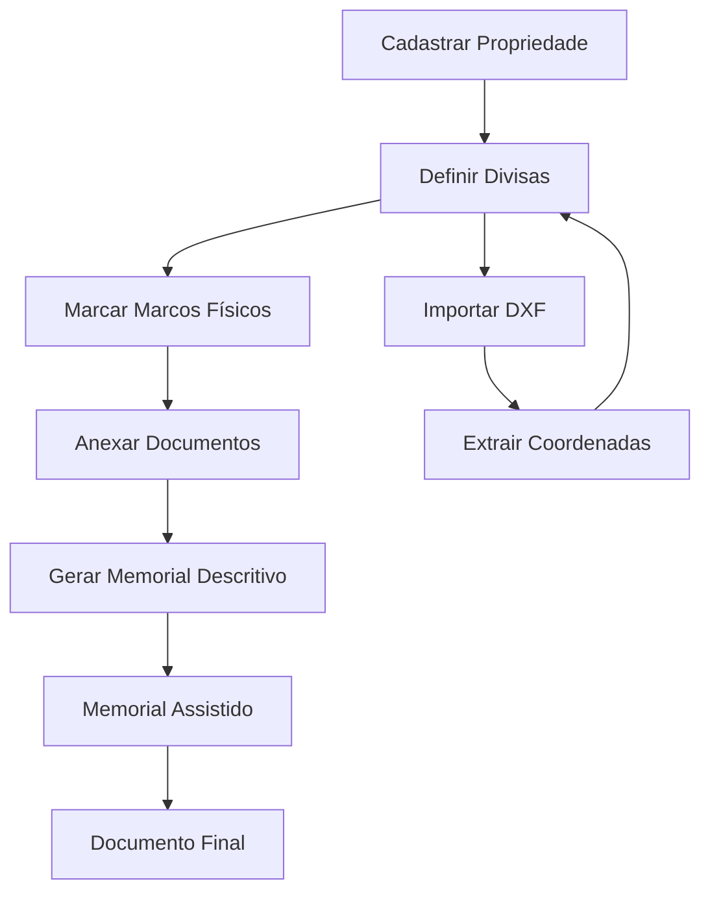

# 🏗️ Sistema de Cadastros - GeoLimites Frontend

## 📋 Visão Geral dos 4 Cadastros Principais

O sistema GeoLimites possui 4 modulos de cadastro integrados que trabalham em conjunto para gerenciar propriedades e gerar memoriais descritivos:

### 1. **📍 Cadastro de Propriedades (Properties)**
### 2. **🔗 Cadastro de Divisas (Property Boundaries)** 
### 3. **🏛️ Cadastro de Marcos (Property Landmarks)**
### 4. **📄 Cadastro de Documentos (Property Documents)**

---

## 🏠 1. CADASTRO DE PROPRIEDADES

### **Objetivo**
Gerenciar informações básicas das propriedades urbanas e rurais.

### **Campos Principais**
```typescript
interface Property {
  propertyId: string;
  registrationNumber: string;    // Número de registro/matrícula
  propertyType: 'URBAN' | 'RURAL';
  address: string;
  neighborhood: string;
  city: string;
  state: string;
  zipCode: string;
  totalArea: number;            // Área total em m²
  builtArea?: number;           // Área construída em m²
  ownerName: string;
  ownerDocument: string;        // CPF/CNPJ do proprietário
  description?: string;
  coordinates?: string;         // Coordenadas geográficas
  active: boolean;
  ownerId: string;
  createdAt: string;
  updatedAt: string;
}
```

### **Funcionalidades Frontend**
- ✅ **Listagem** com filtros por tipo, cidade, proprietário
- ✅ **Cadastro** com validação de campos obrigatórios
- ✅ **Edição** de propriedades existentes
- ✅ **Exclusão** com confirmação
- ✅ **Busca** por número de registro ou endereço
- ✅ **Visualização** detalhada com divisas e marcos relacionados

### **Endpoints Backend**
```
GET    /api/properties              # Listar propriedades
POST   /api/properties              # Criar propriedade
GET    /api/properties/{id}         # Buscar por ID
PUT    /api/properties/{id}         # Atualizar propriedade
DELETE /api/properties/{id}         # Excluir propriedade
GET    /api/properties/search       # Buscar com filtros
```

---

## 🔗 2. CADASTRO DE DIVISAS (BOUNDARIES)

### **Objetivo**
Gerenciar as divisas/confrontações de cada propriedade com detalhes técnicos.

### **Campos Principais**
```typescript
interface PropertyBoundary {
  boundaryId: string;
  propertyId: string;           // FK para Property
  direction: 'NORTH' | 'SOUTH' | 'EAST' | 'WEST';
  description: string;          // Descrição da divisa
  length: number;               // Comprimento em metros
  startPoint: string;           // Ponto inicial (ex: P01)
  endPoint: string;             // Ponto final (ex: P02)
  neighborProperty?: string;    // Propriedade vizinha
  publicArea?: string;          // Via pública (se aplicável)
  coordinates?: string;         // Coordenadas dos pontos
  observations?: string;
  active: boolean;
  createdAt: string;
  updatedAt: string;
}
```

### **Funcionalidades Frontend**
- ✅ **Gestão por Propriedade** - Divisas organizadas por propriedade
- ✅ **Cadastro Sequencial** - Adicionar divisas Norte → Sul → Leste → Oeste
- ✅ **Validação Geométrica** - Verificar fechamento do polígono
- ✅ **Cálculo Automático** - Perímetro total da propriedade
- ✅ **Visualização Gráfica** - Representação das divisas no mapa
- ✅ **Importação DXF** - Extrair divisas automaticamente do arquivo

### **Endpoints Backend**
```
GET    /api/property-boundaries/property/{propertyId}  # Divisas da propriedade
POST   /api/property-boundaries                        # Criar divisa
PUT    /api/property-boundaries/{id}                   # Atualizar divisa
DELETE /api/property-boundaries/{id}                   # Excluir divisa
GET    /api/property-boundaries/{id}/validate          # Validar geometria
```

---

## 🏛️ 3. CADASTRO DE MARCOS (LANDMARKS)

### **Objetivo**
Gerenciar marcos físicos e pontos de referência das propriedades.

### **Campos Principais**
```typescript
interface PropertyLandmark {
  landmarkId: string;
  propertyId: string;           // FK para Property
  landmarkType: 'CONCRETE_PILLAR' | 'IRON_STAKE' | 'NATURAL_BOUNDARY' | 'BUILDING' | 'OTHER';
  name: string;                 // Nome/identificação do marco
  description: string;
  coordinates: string;          // Coordenadas precisas (E, N)
  elevation?: number;           // Altitude/cota
  material?: string;            // Material do marco
  condition: 'GOOD' | 'REGULAR' | 'BAD' | 'DESTROYED';
  installationDate?: string;
  lastInspection?: string;
  photos?: string[];            // URLs das fotos
  observations?: string;
  active: boolean;
  createdAt: string;
  updatedAt: string;
}
```

### **Funcionalidades Frontend**
- ✅ **Mapeamento Visual** - Marcos plotados no mapa da propriedade
- ✅ **Galeria de Fotos** - Upload e visualização de imagens dos marcos
- ✅ **Histórico de Inspeções** - Controle de manutenção dos marcos
- ✅ **Filtros por Condição** - Marcos que precisam de manutenção
- ✅ **Relatório de Marcos** - Exportação para memorial descritivo
- ✅ **Coordenadas Precisas** - Integração com GPS/topografia

### **Endpoints Backend**
```
GET    /api/property-landmarks/property/{propertyId}   # Marcos da propriedade
POST   /api/property-landmarks                         # Criar marco
PUT    /api/property-landmarks/{id}                    # Atualizar marco
DELETE /api/property-landmarks/{id}                    # Excluir marco
POST   /api/property-landmarks/{id}/photos             # Upload de fotos
GET    /api/property-landmarks/condition/{condition}   # Filtrar por condição
```

---

## 📄 4. CADASTRO DE DOCUMENTOS (DOCUMENTS)

### **Objetivo**
Gerenciar documentos relacionados às propriedades (escrituras, plantas, certidões).

### **Campos Principais**
```typescript
interface PropertyDocument {
  documentId: string;
  propertyId: string;           // FK para Property
  documentType: 'DEED' | 'SURVEY_PLAN' | 'CERTIFICATE' | 'MEMORIAL' | 'DXF_FILE' | 'OTHER';
  title: string;
  description?: string;
  fileName: string;
  filePath: string;
  fileSize: number;
  mimeType: string;
  documentNumber?: string;      // Número oficial do documento
  issueDate?: string;           // Data de emissão
  expiryDate?: string;          // Data de validade
  issuer?: string;              // Órgão emissor
  registrationNumber?: string;  // Número de registro
  version: number;              // Controle de versão
  tags?: string[];              // Tags para organização
  active: boolean;
  ownerId: string;
  createdAt: string;
  updatedAt: string;
}
```

### **Funcionalidades Frontend**
- ✅ **Upload Múltiplo** - Arrastar e soltar arquivos
- ✅ **Visualizador Integrado** - PDF, imagens, DXF no browser
- ✅ **Controle de Versão** - Histórico de alterações dos documentos
- ✅ **Organização por Tags** - Sistema de etiquetas personalizadas
- ✅ **Busca Avançada** - Por tipo, data, número do documento
- ✅ **Download em Lote** - Exportar documentos selecionados
- ✅ **Integração Memorial** - Documentos usados na geração automática

### **Endpoints Backend**
```
GET    /api/property-documents/property/{propertyId}   # Documentos da propriedade
POST   /api/property-documents/upload                  # Upload de documento
GET    /api/property-documents/{id}/download           # Download do arquivo
PUT    /api/property-documents/{id}                    # Atualizar metadados
DELETE /api/property-documents/{id}                    # Excluir documento
GET    /api/property-documents/search                  # Busca avançada
```

---

## 🔄 INTEGRAÇÕES ENTRE OS CADASTROS

### **Fluxo Principal de Trabalho**



### **1. Propriedade → Divisas**
- Ao criar uma propriedade, o sistema sugere criar as 4 divisas básicas
- Cálculo automático do perímetro e área baseado nas divisas
- Validação geométrica para garantir fechamento do polígono

### **2. Propriedade → Marcos**
- Marcos são plotados automaticamente nos vértices das divisas
- Sistema sugere marcos nos pontos de mudança de direção
- Coordenadas dos marcos alimentam o cálculo das divisas

### **3. Propriedade → Documentos**
- Documentos são organizados por propriedade
- DXF/DWG são processados para extrair coordenadas automaticamente
- Memoriais gerados são salvos automaticamente como documentos

### **4. Integracao com Memorial Assistido**
- Dados das divisas alimentam o prompt de geracao assistida
- Coordenadas dos marcos são usadas para precisão técnica
- Documentos anexos servem como referência adicional

---

## 🎨 INTERFACE FRONTEND - ESTRUTURA

### **Layout Principal**
```
┌─────────────────────────────────────────────────────┐
│ 🏠 GeoLimites - Navbar                             │
├─────────────┬───────────────────────────────────────┤
│ Sidebar     │ Área Principal                        │
│             │                                       │
│ 📍 Propriedades │ ┌─ Listagem/Formulário ─┐        │
│ 🔗 Divisas      │ │                        │        │
│ 🏛️ Marcos       │ │   Conteúdo Dinâmico   │        │
│ 📄 Documentos   │ │                        │        │
│ 🧠 Memorial     │ └────────────────────────┘        │
│                 │                                   │
└─────────────────┴───────────────────────────────────┘
```

### **Páginas Principais**

#### **1. /properties** - Gestão de Propriedades
- Lista com cards das propriedades
- Filtros: tipo, cidade, proprietário
- Botão "Nova Propriedade" → Modal/página de cadastro
- Ações: Visualizar, Editar, Excluir, Ver Divisas/Marcos

#### **2. /properties/{id}/boundaries** - Divisas da Propriedade
- Mapa visual das divisas
- Lista das 4 direções (N, S, L, O)
- Formulário para adicionar/editar cada divisa
- Cálculo automático do perímetro total

#### **3. /properties/{id}/landmarks** - Marcos da Propriedade
- Mapa com marcos plotados
- Lista de marcos com fotos
- Formulário para adicionar novos marcos
- Filtros por tipo e condição

#### **4. /properties/{id}/documents** - Documentos da Propriedade
- Grid de documentos com preview
- Upload por drag & drop
- Visualizador integrado (PDF, imagens, DXF)
- Sistema de tags e busca

#### **5. /memorial/generate** - Geração de Memorial
- Seleção da propriedade
- Configuração da norma ABNT
- Preview em tempo real
- Download do memorial final

---

## 🛠️ COMPONENTES REUTILIZÁVEIS

### **1. PropertyCard.tsx**
```typescript
interface PropertyCardProps {
  property: Property;
  onView: (id: string) => void;
  onEdit: (id: string) => void;
  onDelete: (id: string) => void;
}
```

### **2. BoundaryForm.tsx**
```typescript
interface BoundaryFormProps {
  propertyId: string;
  boundary?: PropertyBoundary;
  onSave: (boundary: PropertyBoundary) => void;
  onCancel: () => void;
}
```

### **3. LandmarkMap.tsx**
```typescript
interface LandmarkMapProps {
  landmarks: PropertyLandmark[];
  boundaries: PropertyBoundary[];
  onLandmarkClick: (landmark: PropertyLandmark) => void;
  onAddLandmark: (coordinates: string) => void;
}
```

### **4. DocumentViewer.tsx**
```typescript
interface DocumentViewerProps {
  document: PropertyDocument;
  onClose: () => void;
}
```

### **5. MemorialPreview.tsx**
```typescript
interface MemorialPreviewProps {
  propertyId: string;
  standardId: string;
  onGenerate: () => void;
}
```

---

## 📱 RESPONSIVIDADE E UX

### **Mobile First**
- Layout adaptável para tablets e smartphones
- Navegação por tabs em telas menores
- Upload de fotos via câmera do dispositivo
- Mapas otimizados para touch

### **Feedback Visual**
- Loading states durante operações
- Notificações toast para ações
- Validação em tempo real nos formulários
- Progress bars para uploads

### **Acessibilidade**
- Navegação por teclado
- Labels descritivos
- Contraste adequado
- Suporte a screen readers

---

## 🔧 TECNOLOGIAS E DEPENDÊNCIAS

### **Core**
```json
{
  "react": "^18.2.0",
  "typescript": "^5.0.0",
  "react-router-dom": "^6.8.0",
  "axios": "^1.3.0"
}
```

### **UI/UX**
```json
{
  "react-hook-form": "^7.43.0",
  "react-query": "^3.39.0",
  "react-hot-toast": "^2.4.0",
  "framer-motion": "^10.0.0"
}
```

### **Mapas e Visualização**
```json
{
  "leaflet": "^1.9.0",
  "react-leaflet": "^4.2.0",
  "three": "^0.150.0",
  "dxf-parser": "^1.7.0"
}
```

### **Upload e Arquivos**
```json
{
  "react-dropzone": "^14.2.0",
  "file-saver": "^2.0.5",
  "react-pdf": "^6.2.0"
}
```

---

## 🚀 PRÓXIMOS PASSOS

1. **Implementar estrutura base** dos 4 cadastros
2. **Criar componentes reutilizáveis** 
3. **Integrar com APIs** do backend existente
4. **Implementar mapas** e visualização DXF
5. **Testes e refinamentos** da UX
6. **Deploy e documentação** final

**O sistema está pronto para desenvolvimento com backend totalmente funcional!** 🎯
