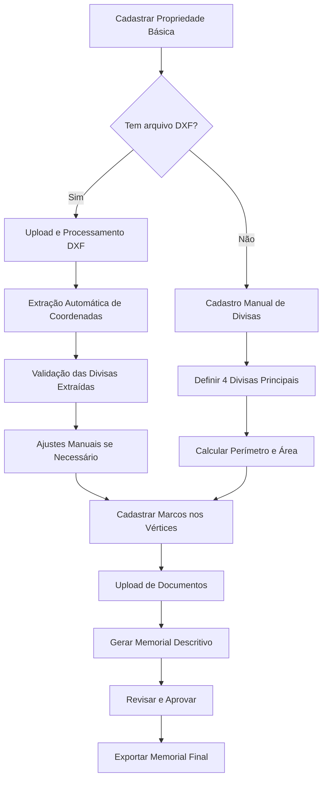

# 🔄 Fluxos de Integracao - GeoLimites

## 🎯 Visão Geral dos Fluxos

O sistema GeoLimites possui 5 fluxos principais de integracao entre os cadastros:

1. **🏠 Fluxo Completo de Propriedade** - Do cadastro ao memorial
2. **📁 Fluxo de Importação DXF** - Automação via arquivo técnico  
3. **🔗 Fluxo de Divisas Integradas** - Validação geométrica
4. **🏛️ Fluxo de Marcos Topográficos** - Precisão técnica
5. **🧠 Fluxo de Memorial Assistido** - Geracao assistida + dados estruturados

---

## 🏠 1. FLUXO COMPLETO DE PROPRIEDADE

### **Objetivo**
Processo completo desde o cadastro inicial até a geração do memorial descritivo.

### **Etapas do Fluxo**



### **Implementação Frontend**

#### **Página: PropertyWizard.tsx**
```typescript
interface PropertyWizardStep {
  id: number;
  title: string;
  component: React.ComponentType<any>;
  isComplete: boolean;
  isOptional: boolean;
}

const PropertyWizard = () => {
  const [currentStep, setCurren
